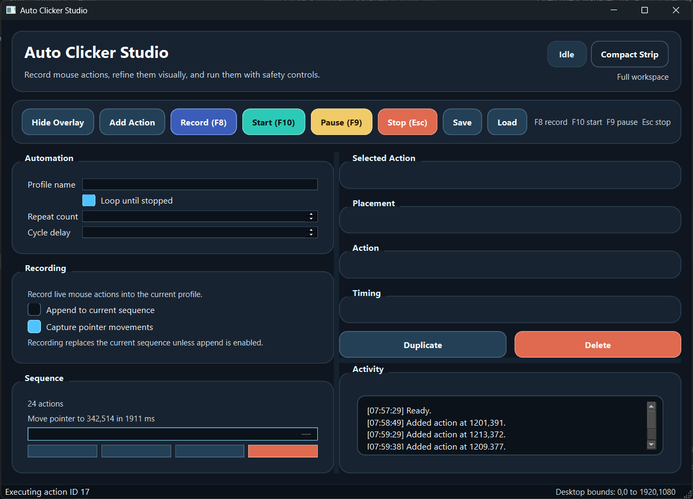
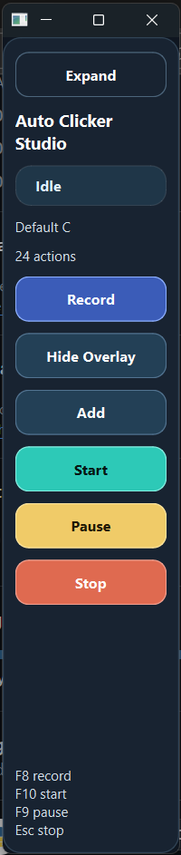

# Auto Clicker Studio 🖱️

[]()
[]()

**Auto Clicker Studio** is a powerful, visually-driven desktop automation suite designed for precision and ease of use. Record complex mouse actions, refine them with a visual timeline, and execute them with robust safety controls.

---

## 🌟 Key Features

- **Intuitive Visual Editing**: Manage your automation sequence with a dynamic node-based canvas.
- **Dual View Modes**: Switch between a comprehensive **Main Workspace** and a space-saving **Compact Strip**.
- **Live Recording**: Capture mouse clicks and movements in real-time.
- **Safety First**: Integrated hotkeys for instant **Start (F10)**, **Pause (F9)**, and **Emergency Stop (Esc)**.
- **Overlay Support**: An identifiable mask overlay helps you place nodes with pixel-perfect accuracy.
- **Profile Management**: Save and load your automation sequences for different tasks.

---

## 📸 Screenshots

### Main Workspace

*The comprehensive workspace for creating and managing complex automation sequences.*

### Compact Mode

*A minimalist interface that stays out of your way while running automations.*

---

## 🚀 Getting Started

### Prerequisites

- Python 3.8+
- PyQt6

### Installation

1. **Clone the repository**:
   ```bash
   git clone https://github.com/VaishnevSreejeev/Auto-Clicker-Studio.git
   cd Auto-Clicker-Studio
   ```

2. **Install dependencies**:
   ```bash
   pip install -r requirements.txt
   ```

3. **Run the application**:
   ```bash
   python main.py
   ```

---

## ⌨️ Hotkeys

| Action | Key |
| :--- | :--- |
| **Record** | `F8` |
| **Start** | `F10` |
| **Pause** | `F9` |
| **Emergency Stop** | `Esc` |

---

## 🛠️ Built With

- **[PyQt6](https://www.riverbankcomputing.com/software/pyqt/)** - The GUI framework.
- **Python** - Core logic and automation.

---

## 📄 License

This project is licensed under the MIT License - see the [LICENSE](LICENSE) file for details.

---

*Created with ❤️ by [Vaishnev Sreejeev](https://github.com/VaishnevSreejeev)*
